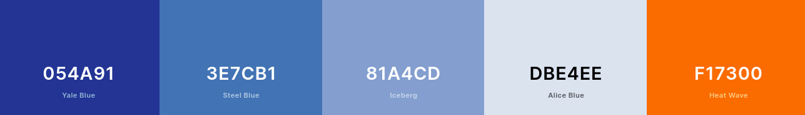

# Front-End Challenge 🏅 2021

## Introdução

Desafio Frontend da Coodesh: O objetivo nesse projeto, é trabalhar no desenvolvimento do Front end que consumirá a API da empresa Pharma Inc seguindo os requisitos propostos no desafio.

## Case

A empresa Pharma Inc, está trabalhando em um projeto em colaboração com sua base de clientes para facilitar a gestão e visualização da informação dos seus pacientes de maneira simples e objetiva em um Dashboard onde podem listar, filtrar e expandir os dados disponíveis.

## Identidade Visual

A identidade visual proposta para a empresa são tons de azul e laranja, que representam respectivamente confiança, segurança e vitalidade.

## Tecnologias
- ✔️ Angular

## Lista de Pacientes

A tela inicial do projeto será um lista de pacientes que deverá conter um buscador para facilitar filtrar todos os que são exibidos na lista, proposta:

### Visualizar paciente

Na coluna de ações da tabela, existe o botão visualizar para expandir os dados dos pacientes. Seguir o modelo proposto:

Devemos exibir os seguintes campos do paciente:
- Imagem
- Nome completo
- Email
- Gênero
- Data de nascimento
- Telefone
- Nacionalidade
- Endereço
- ID (Número de identificação)
- URL para compartilhamento

## Em desenvolvimento
- Criar tela inicial (Lista de pacientes)
- Finalizar e inserir logo e favicon
- Atualizar README